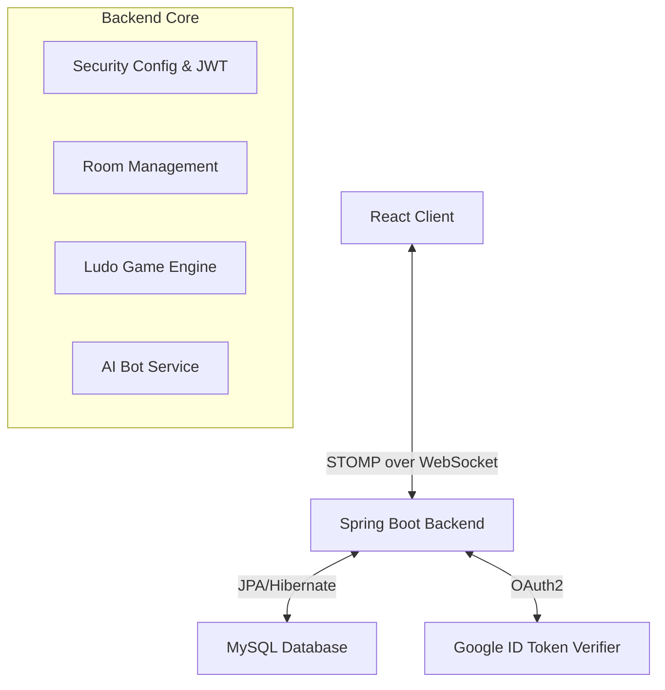

# 🎲 LudoArena: Premium Real-Time Multiplayer Experience

LudoArena is a high-performance, full-stack web application that brings the classic board game experience into the modern digital era. Engineered for precision, it features a pixel-perfect SVG-rendered board, real-time WebSocket synchronization, and a robust Spring Boot micro-engine.

> **Created by: chingkheinganba Luwangthem**

---

## 🏗 System Architecture

The following diagram illustrates the real-time communication flow between the React frontend and the Spring Boot backend via STOMP WebSockets.

---

## 🚀 Key Features

### 🎮 Gameplay Mechanics
- **Real-Time Sync**: Zero-latency token movement across all players using STOMP Messaging.
- **Smart AI Bots**: Integrated random-logic bots to fill empty slots and keep the game moving.
- **Safe Zones & Kills**: Full implementation of official Ludo rules, including star safe zones and capture-to-home logic.
- **Smooth Animations**: Glitch-free, step-by-step token gliding using React `useLayoutEffect` for visual precision.

### 🛡 Security & Authentication
- **Google OAuth 2.0**: Seamless one-tap login using official Google credentials.
- **JWT Authentication**: Stateless, secure token-based access control for all API endpoints.
- **Guest Access**: Instantly play without an account using auto-generated guest profiles.

### 💰 Economy & Social
- **Coin System**: Earn coins by winning games. Use coins to join high-stakes matches.
- **Global Leaderboards**: Competitive ranking system showing the top players by win rate and total coins.
- **Personalized Profiles**: Customizable display names and avatar selection (including Google profile pictures sync).
- **In-Game Sounds**: Immersive sound effects for rolling dice, moving tokens, captures, and game starts.

---

## 🛠 Technical Stack

### **Frontend**
- **Framework**: `React 19` (Vite)
- **UI Library**: `Material UI v7` (Custom Glassmorphism theme)
- **State Management**: React Context API (Auth & Game states)
- **Real-Time**: `@stomp/stompjs` & `SockJS`
- **Authentication**: `@react-oauth/google`

### **Backend**
- **Core**: `Spring Boot 3.2.3` (Java 17)
- **Security**: Spring Security + JWT
- **Real-Time**: Spring WebSocket Message Broker
- **Persistence**: Spring Data JPA + MySQL
- **Validation**: Google API Client (OAuth Token Verification)

---

## 🔄 Core Workflow

1.  **Authentication**: User logs in (Google/Local/Guest) -> Backend issues a signed JWT.
2.  **Room Creation**: User creates a room -> Backend generates a unique Room Code and persists it in MySQL.
3.  **Lobby**: Players join via code -> WebSocket broadcasts names/avatars to everyone in the room.
4.  **Gameplay**: 
    - Admin starts -> Game state initializes.
    - Player rolls dice -> Server validates turn and result.
    - Player moves token -> Engine calculates path, checks for kills/finish, and broadcasts delta.
5.  **Completion**: Game ends -> Coins are awarded -> Stats updated in Database.

---

## 🌐 Deployment Guide

LudoArena is optimized for cloud deployment:
- **Backend**: Hosted on **Render** (via Docker/JAR service).
- **Frontend**: Hosted on **Vercel** for lightning-fast Edge delivery.
- **Database**: Managed **MySQL** (Aiven or Railway).

### **Environment Variables Required**
| Variable | Description |
| :--- | :--- |
| `SPRING_DATASOURCE_URL` | Cloud MySQL connection string |
| `JWT_SECRET` | 512-bit HS512 secret key |
| `GOOGLE_CLIENT_ID` | From Google Cloud Console |
| `VITE_API_URL` | Your Render production URL |

---

## 👨‍💻 Developer
Built with ❤️ by **chingkheinganba Luwangthem**. 
*Focusing on high-concurrency systems, immersive UI design, and scalable full-stack architectures.*
